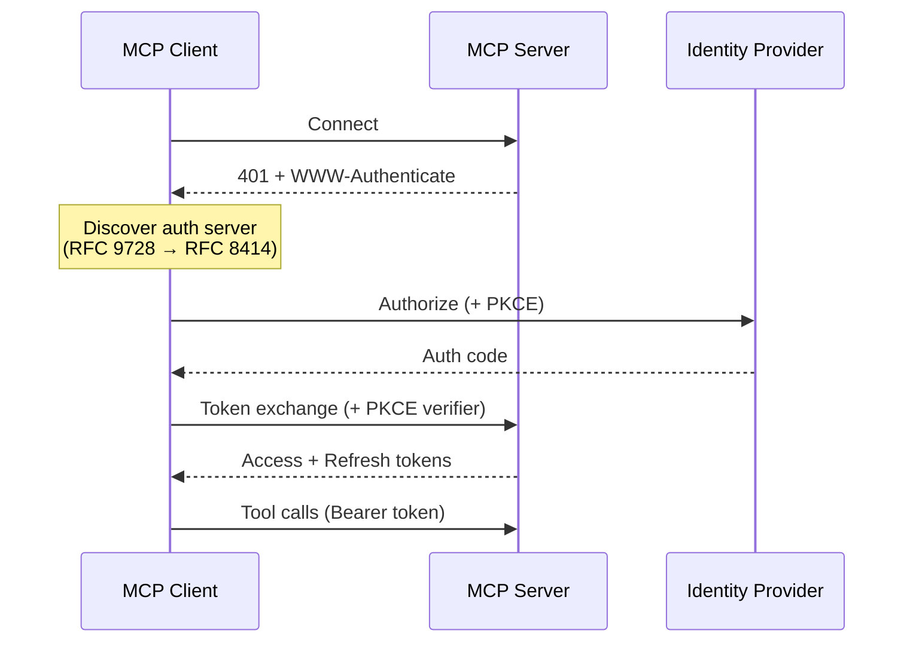
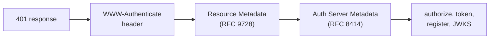

<!--
Check ../docs_writer_prompt.md before changing this file.

This document covers MCP authentication concepts. Include:
- OAuth 2.1 flow overview
- Discovery mechanism (RFC 9728, RFC 8414)
- Client registration (DCR vs CIMD)
- Device flow for headless clients
- Standards quick reference
-->

The MCP specification standardized on OAuth 2.1 for authentication. For a detailed walkthrough of the flow with code examples, see the [official MCP Authorization tutorial](https://modelcontextprotocol.io/docs/tutorials/security/authorization).

This page summarizes the key mechanisms and how they relate to each other.

## The Flow

MCP auth follows OAuth 2.1 Authorization Code with PKCE. In short:

1. Client connects, server returns 401 with `WWW-Authenticate` header
2. Client discovers auth server via resource metadata (RFC 9728) then auth server metadata (RFC 8414)
3. Client registers if needed (DCR, RFC 7591) or uses CIMD
4. User authorizes via browser, client gets authorization code
5. Client exchanges code for access + refresh tokens (with PKCE)
6. Client uses Bearer token for all subsequent requests

**PKCE** is required by the MCP spec because MCP clients are typically public clients (desktop apps, CLI tools). In practice, not all providers enforce it — GitHub, for example, doesn't support PKCE. Gateways like Archestra handle both cases gracefully.

## Discovery

No hardcoded URLs needed. Two standards automate endpoint discovery:

| Standard | Endpoint | Purpose |
|---|---|---|
| RFC 9728 | `/.well-known/oauth-protected-resource/{path}` | Which auth server protects this resource |
| RFC 8414 | `/.well-known/oauth-authorization-server` | OAuth endpoint discovery |

## Client Registration: DCR vs CIMD

When a client connects for the first time, it needs a `client_id`:

| Approach | How it works | Trade-offs |
|---|---|---|
| **DCR** (RFC 7591) | Client registers with each server at runtime | Traditional. "Client sprawl" at scale. Good for enterprise. |
| **CIMD** | Client identity = stable HTTPS URL. URL is the `client_id`. | MCP default since Nov 2025. No registration endpoint. Decentralized. |

## Device Flow (RFC 8628)

For headless clients (terminals, CI/CD, servers) that can't open a browser: server gives user a code + URL, user authorizes on any device, client polls until complete.

## Standards Quick Reference

| Standard | Purpose |
|---|---|
| OAuth 2.1 + PKCE | Authorization framework (PKCE not universally enforced) |
| RFC 9728 | Protected Resource Metadata |
| RFC 8414 | Authorization Server Metadata |
| RFC 7591 | Dynamic Client Registration |
| CIMD | URL-based client identity (MCP default since Nov 2025) |
| RFC 8628 | Device Authorization Flow |

## Further Reading

- [MCP Authorization Tutorial](https://modelcontextprotocol.io/docs/tutorials/security/authorization) — step-by-step implementation with Keycloak
- [MCP Authorization Specification](https://modelcontextprotocol.io/specification/2025-03-26/basic/authorization)
- [CIMD vs DCR](https://workos.com/blog/mcp-client-registration-cimd-vs-dcr) (WorkOS)
- [MCP Secrets Management Best Practices](https://workos.com/guide/best-practices-for-mcp-secrets-management) (WorkOS)

See [Using MCP Servers with Authentication](/docs/platform-mcp-server-authentication) and [Building MCP Servers with Authentication](/docs/platform-building-mcp-server-auth) for how Archestra implements these standards.
