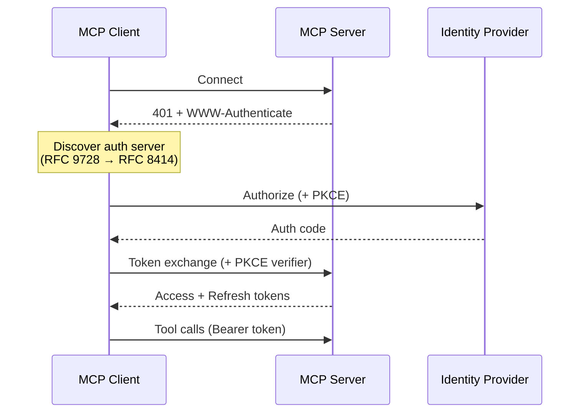
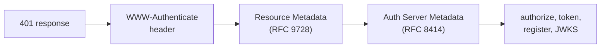
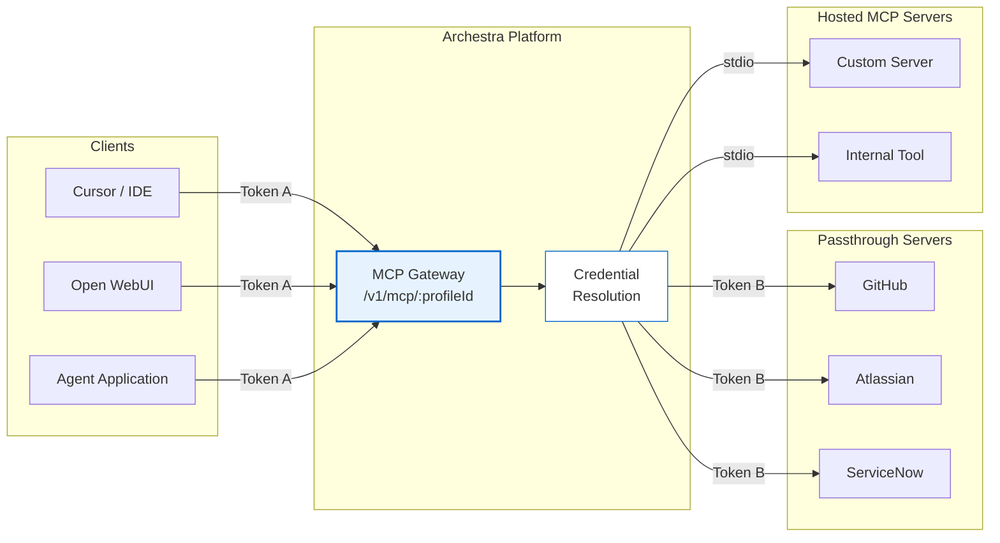
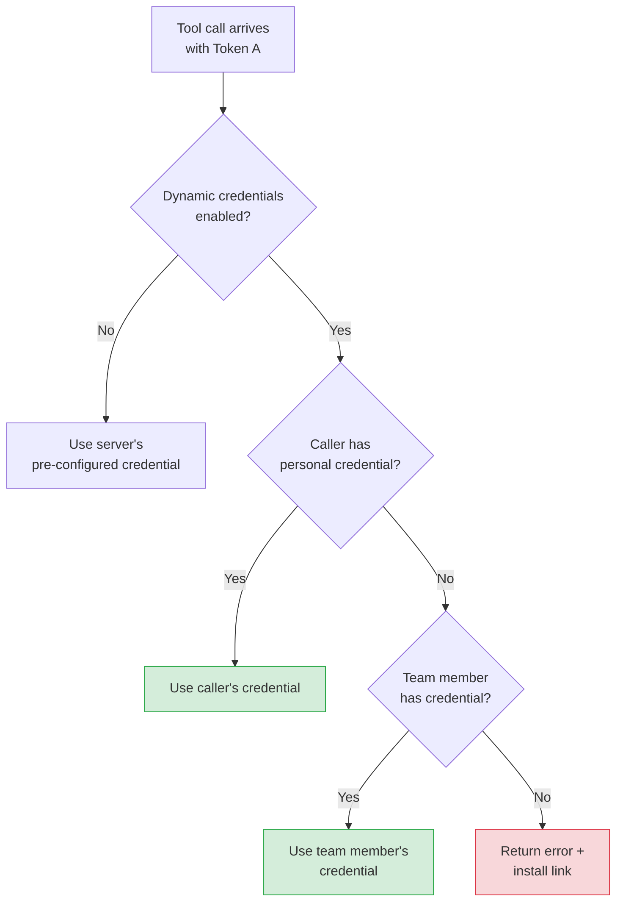
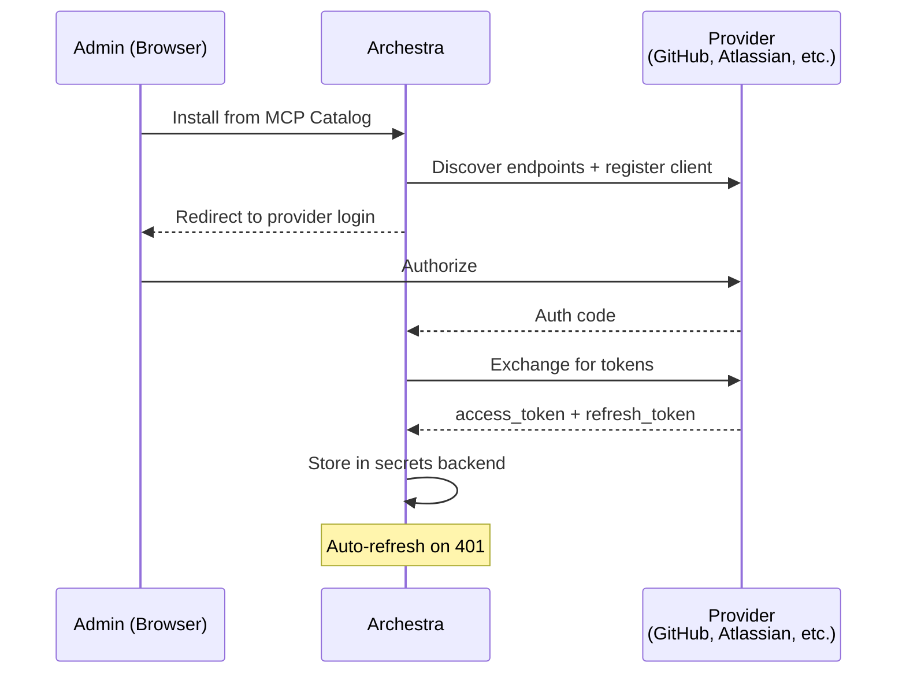
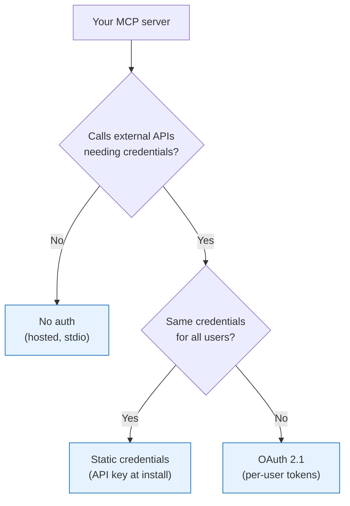

<!--
Check ../docs_writer_prompt.md before changing this file.
-->

The MCP specification standardized on OAuth 2.1 for client authentication. This page covers how clients authenticate to Archestra's gateway, how Archestra manages credentials for upstream MCP servers, and the auth patterns available when building your own MCP servers.

## MCP OAuth 2.1

MCP auth follows OAuth 2.1 Authorization Code with PKCE. In short:

1. Client connects, server returns 401 with `WWW-Authenticate` header
2. Client discovers auth server via resource metadata (RFC 9728) then auth server metadata (RFC 8414)
3. Client registers if needed (DCR, RFC 7591) or uses CIMD
4. User authorizes via browser, client gets authorization code
5. Client exchanges code for access + refresh tokens (with PKCE)
6. Client uses Bearer token for all subsequent requests

**PKCE** is required by the MCP spec because MCP clients are typically public clients (desktop apps, CLI tools). In practice, not all providers enforce it — GitHub, for example, doesn't support PKCE. Gateways like Archestra handle both cases gracefully.

### Discovery

No hardcoded URLs needed. Two standards automate endpoint discovery:

| Standard | Endpoint | Purpose |
|---|---|---|
| RFC 9728 | `/.well-known/oauth-protected-resource/{path}` | Which auth server protects this resource |
| RFC 8414 | `/.well-known/oauth-authorization-server` | OAuth endpoint discovery |

### Client Registration: DCR vs CIMD

When a client connects for the first time, it needs a `client_id`:

| Approach | How it works | Trade-offs |
|---|---|---|
| **DCR** (RFC 7591) | Client registers with each server at runtime | Traditional. "Client sprawl" at scale. Good for enterprise. |
| **CIMD** | Client identity = stable HTTPS URL. URL is the `client_id`. | MCP default since Nov 2025. No registration endpoint. Decentralized. |

### Device Flow (RFC 8628)

For headless clients (terminals, CI/CD, servers) that can't open a browser: server gives user a code + URL, user authorizes on any device, client polls until complete.

## Upstream Credentials

MCP servers that connect to services like GitHub, Atlassian, or ServiceNow need credentials. Archestra manages this with a two-token model:

- **Token A** — authenticates the client (Cursor, Open WebUI, agent app) to the Archestra gateway. See [MCP Gateway](/docs/platform-mcp-gateway) for connection details.
- **Token B** — authenticates the Archestra gateway to the upstream MCP server.

The client sends Token A. Archestra resolves Token B at runtime. The client never sees upstream credentials.

Credentials are set during installation from the MCP Catalog:

- **Static secrets** — API keys, PATs. Set once at install time.
- **OAuth tokens** — Obtained via OAuth flow against the upstream provider during installation. Access and refresh tokens stored.

For **passthrough** servers: `Authorization: Bearer` header over HTTP.
For **hosted** servers: stdio transport within K8s — no auth headers needed.

Stored in the secrets backend (database by default, [external secrets manager](/docs/platform-secrets-management) for enterprise).

### Per-User Credentials

Default: one credential per MCP server installation, shared by all callers.

With "Resolve at call time" enabled: Archestra resolves the credential dynamically based on the caller's identity. This enables multi-tenant setups — each developer uses their own GitHub PAT, each team member their own Jira access.

Priority order:
1. Calling user's own credential (highest)
2. Team member's credential
3. Error with install link

### Missing Credentials

When no credential is found, the gateway returns an actionable error:

> Authentication required for "GitHub MCP Server".
> No credentials found for your account (user: alice@company.com).
> Set up credentials: https://archestra.company.com/mcp-catalog/registry?install=abc-123

The user installs the MCP server with their credentials and retries. In chat, this appears as a message with a clickable link.

### OAuth for Upstream Servers

For servers using OAuth (not static keys), Archestra runs the full OAuth flow at installation time:

Key behaviors:
- **Auto-refresh**: On 401, Archestra uses the refresh token to get a new access token and retries. No user intervention.
- **Refresh failures**: Tracked per server. Visible in the MCP server status.

## Building MCP Servers

Three authentication patterns for MCP servers deployed through Archestra, depending on whether your server needs external credentials and whether they differ per user.

| Pattern | When | How |
|---|---|---|
| No auth | Internal tool, no external APIs | Hosted in K8s, gateway uses stdio or streamable-http |
| Static credentials | Shared API key or service account | User provides at install, Archestra stores and injects |
| OAuth 2.1 | Per-user access to a SaaS API | Full OAuth flow at install, auto-refresh by Archestra |

### No Auth (Hosted)

Your server runs in Archestra's K8s cluster. Gateway connects via stdio (kubectl attach) or streamable-http. No auth headers — same cluster, same trust boundary.

Build with the MCP SDK, deploy via MCP Catalog. See [MCP Orchestrator](/docs/platform-orchestrator).

### Static Credentials

Your server needs an API key or service token:

1. Define credential fields in the catalog entry (e.g., `JIRA_API_TOKEN`, `BASE_URL`)
2. Users provide values when installing from the catalog
3. Archestra stores them (DB or [Vault](/docs/platform-secrets-management)) and passes them to your server

All tool calls through the gateway use the same credential.

### OAuth 2.1

Your server connects to a SaaS API where each user has their own account (GitHub, Salesforce, etc.).

What your server (or its OAuth provider) needs to expose:
- `/.well-known/oauth-protected-resource` — resource metadata pointing to the auth server
- 401 + `WWW-Authenticate` header when tokens are expired

What Archestra handles:
- Endpoint discovery, client registration, authorization code flow with PKCE, token storage, and automatic refresh on 401

Your server receives `Authorization: Bearer <access_token>` with each request from the gateway.

## Standards Quick Reference

| Standard | Purpose |
|---|---|
| OAuth 2.1 + PKCE | Authorization framework (PKCE not universally enforced) |
| RFC 9728 | Protected Resource Metadata |
| RFC 8414 | Authorization Server Metadata |
| RFC 7591 | Dynamic Client Registration |
| CIMD | URL-based client identity (MCP default since Nov 2025) |
| RFC 8628 | Device Authorization Flow |

## Further Reading

- [MCP Authorization Tutorial](https://modelcontextprotocol.io/docs/tutorials/security/authorization) — step-by-step implementation with Keycloak
- [MCP Authorization Specification](https://modelcontextprotocol.io/specification/2025-03-26/basic/authorization)
- [CIMD vs DCR](https://workos.com/blog/mcp-client-registration-cimd-vs-dcr) (WorkOS)
- [MCP Secrets Management Best Practices](https://workos.com/guide/best-practices-for-mcp-secrets-management) (WorkOS)
