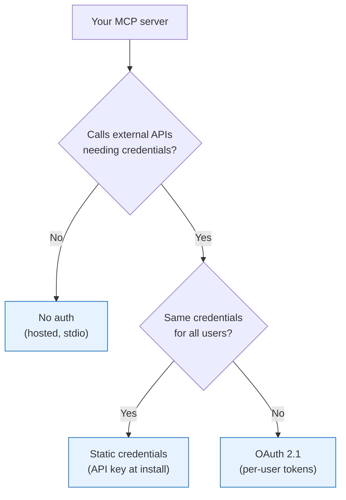

<!--
Check ../docs_writer_prompt.md before changing this file.

This document covers building MCP servers with authentication for Archestra. Include:
- Choosing an auth pattern (no auth, static credentials, OAuth 2.1)
- Hosted server setup (stdio, streamable-http)
- Static credential injection
- OAuth 2.1 flow for per-user access
- IdP integration overview
- Archestra discovery endpoints
-->

Three authentication patterns for MCP servers deployed through Archestra, depending on whether your server needs external credentials and whether they differ per user.

## Auth Patterns

| Pattern | When | How |
|---|---|---|
| No auth | Internal tool, no external APIs | Hosted in K8s, gateway uses stdio or streamable-http |
| Static credentials | Shared API key or service account | User provides at install, Archestra stores and injects |
| OAuth 2.1 | Per-user access to a SaaS API | Full OAuth flow at install, auto-refresh by Archestra |

### No Auth (Hosted)

Your server runs in Archestra's K8s cluster. Gateway connects via stdio (kubectl attach) or streamable-http. No auth headers — same cluster, same trust boundary.

Build with the MCP SDK, deploy via MCP Catalog. See [MCP Orchestrator](/docs/platform-orchestrator).

### Static Credentials

Your server needs an API key or service token:

1. Define credential fields in the catalog entry (e.g., `JIRA_API_TOKEN`, `BASE_URL`)
2. Users provide values when installing from the catalog
3. Archestra stores them (DB or [Vault](/docs/platform-secrets-management)) and passes them to your server

All tool calls through the gateway use the same credential.

### OAuth 2.1

Your server connects to a SaaS API where each user has their own account (GitHub, Salesforce, etc.).

What your server (or its OAuth provider) needs to expose:
- `/.well-known/oauth-protected-resource` — resource metadata pointing to the auth server
- 401 + `WWW-Authenticate` header when tokens are expired

What Archestra handles:
- Endpoint discovery, client registration, authorization code flow with PKCE, token storage, and automatic refresh on 401

Your server receives `Authorization: Bearer <access_token>` with each request from the gateway. See [MCP Authentication](/docs/mcp-authentication) for details on discovery and the OAuth 2.1 flow.

## Related

- [MCP Authentication](/docs/mcp-authentication) — OAuth 2.1, discovery, DCR vs CIMD
- [Using MCP Servers with Authentication](/docs/platform-mcp-server-authentication) — Credential resolution and per-user access
- [MCP Gateway](/docs/platform-mcp-gateway) — Gateway setup
- [MCP Orchestrator](/docs/platform-orchestrator) — Hosted server deployment
