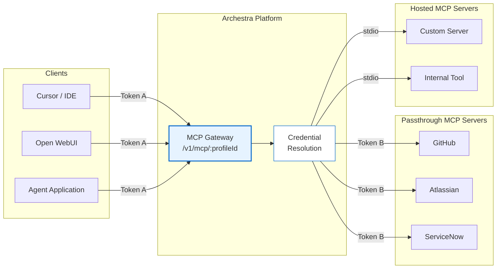
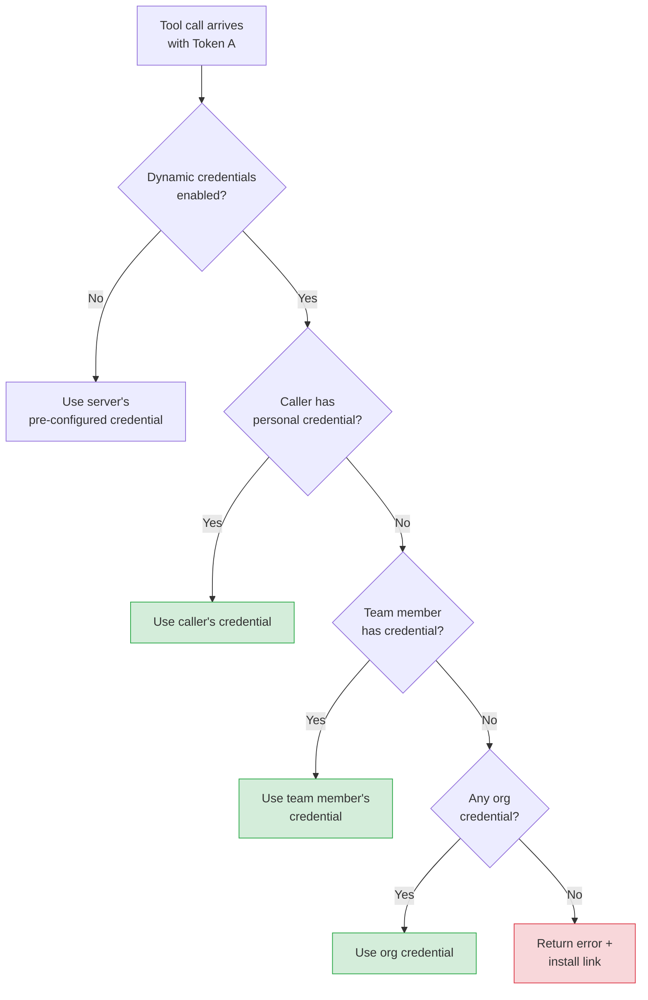
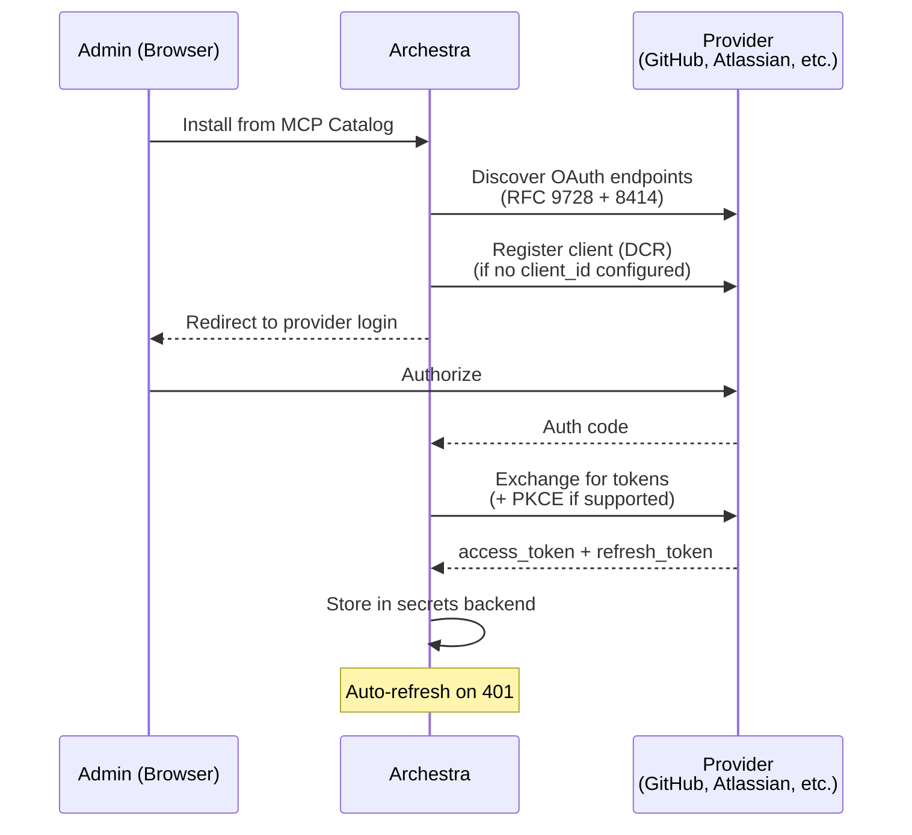

<!--
Check ../docs_writer_prompt.md before changing this file.

This document covers how Archestra manages credentials for MCP servers. Include:
- Two-token model (Token A: client to gateway, Token B: gateway to upstream)
- Hosted vs passthrough servers
- Per-user dynamic credentials
- Missing credential handling
- OAuth flow for upstream servers
-->

MCP servers that connect to services like GitHub, Atlassian, or ServiceNow need credentials. Archestra manages this with a two-token model:

- **Token A** — authenticates the client (Cursor, Open WebUI, agent app) to the Archestra gateway
- **Token B** — authenticates the Archestra gateway to the upstream MCP server

The client sends Token A. Archestra resolves Token B at runtime. The client never sees upstream credentials.

## Terminology

- **Hosted servers** — MCP servers running in Archestra's K8s cluster (containers managed by the orchestrator)
- **Passthrough servers** — Remote third-party MCP servers (GitHub, Atlassian, etc.) that Archestra proxies to

## Architecture

## Token A: Client to Gateway

The MCP Gateway (`POST /v1/mcp/:profileId`) accepts three token types:

| Method | Format | Use case |
|---|---|---|
| Team / Org token | `archestra_*` | CI/CD, shared programmatic access |
| User token | `archestra_*` | Personal access, chat, scoped to user's teams |
| OAuth 2.1 | JWT | MCP-native clients (Open WebUI, Claude Desktop) |

On 401, the gateway returns `WWW-Authenticate` per RFC 9728 — OAuth-capable clients discover and authenticate automatically. Create tokens in **Settings > Tokens**. See [MCP Gateway](/docs/platform-mcp-gateway).

## Token B: Upstream Credentials

Credentials for upstream MCP servers are set during installation from the MCP Catalog:

- **Static secrets** — API keys, PATs. Set once at install time.
- **OAuth tokens** — Obtained via OAuth flow against the upstream provider during installation. Access and refresh tokens stored.

For **passthrough** servers: `Authorization: Bearer` header over HTTP.
For **hosted** servers: stdio transport within K8s — no auth headers needed.

Stored in the secrets backend (database by default, [HashiCorp Vault](/docs/platform-secrets-management) for enterprise).

## Per-User Credentials

Default: one credential per MCP server installation, shared by all callers.

With `useDynamicTeamCredential` enabled: Archestra resolves the credential at call time based on the caller's identity. This enables multi-tenant setups — each developer uses their own GitHub PAT, each team member their own Jira access.

Priority order:
1. Calling user's own credential (highest)
2. Team member's credential
3. Any organization-wide credential
4. Error with install link

## Missing Credentials

When no credential is found, the gateway returns an actionable error:

> Authentication required for "GitHub MCP Server".
> No credentials found for your account (user: alice@company.com).
> Set up credentials: https://archestra.company.com/mcp-catalog/registry?install=abc-123

The user installs the MCP server with their credentials and retries. In chat, this appears as a message with a clickable link.

## OAuth for Upstream Servers

For servers using OAuth (not static keys), Archestra runs the full OAuth flow at installation time:

Key behaviors:
- **PKCE**: Used when the provider supports it. Skipped for providers like GitHub that don't.
- **DCR**: Automatic client registration when no `client_id` is pre-configured.
- **Auto-refresh**: On 401, Archestra uses the refresh token to get a new access token and retries. No user intervention.
- **Refresh failures**: Tracked per server. Visible in the MCP server status.

## Related

- [MCP Authentication](/docs/mcp-authentication) — OAuth 2.1, PKCE, discovery concepts
- [Building MCP Servers with Authentication](/docs/platform-building-mcp-server-auth) — For server developers
- [MCP Gateway](/docs/platform-mcp-gateway) — Connection setup
- [Secrets Management](/docs/platform-secrets-management) — Vault integration
