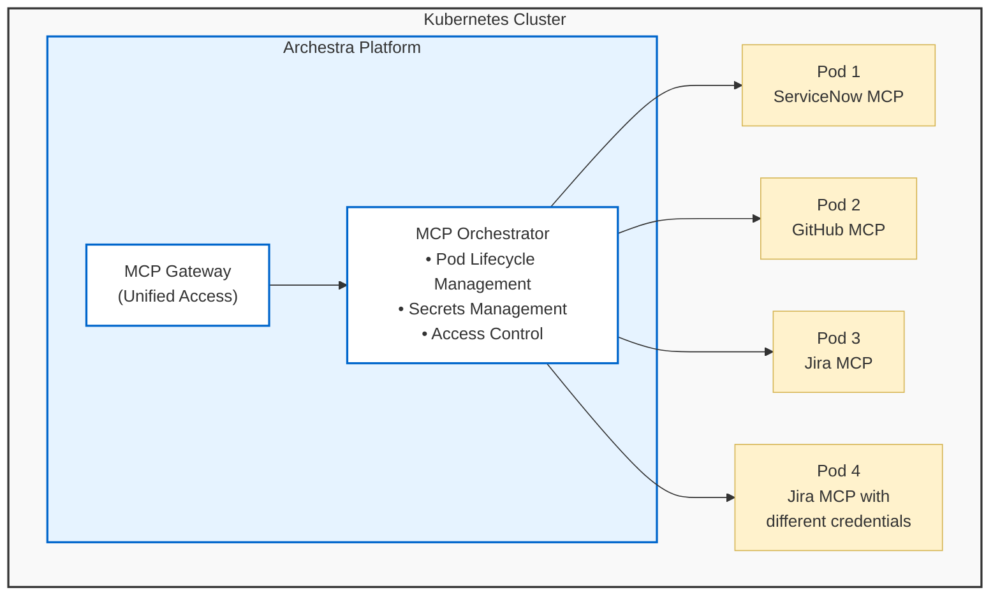
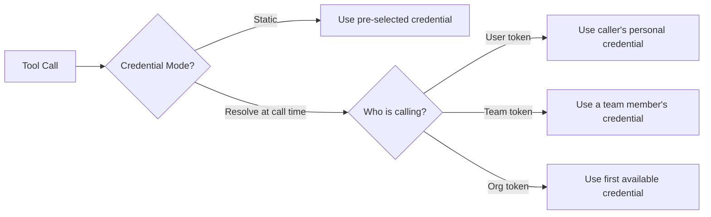

<!--
Check ../docs_writer_prompt.md before changing this file.

This document is human-built, shouldn't be updated with AI. Don't change anything here.

Exception:
- Screenshot
-->

The MCP Orchestrator is Archestra's system for running and managing MCP servers within your existing Kubernetes cluster. It handles the lifecycle of MCP server pods, manages their secrets securely, and provides unified access through the MCP Gateway.

> **Note:** The MCP Orchestrator requires a Kubernetes (K8s) cluster to operate. You still could use Private MCP Registry, MCP Gateway and security features with remote MCP servers, or self-host them and connect to Archestra.



## How It Works

### Pods

Each MCP server runs as a dedicated pod in your Kubernetes cluster:

- **One Pod Per Server**: Each MCP server gets its own isolated pod
- **Automatic Lifecycle**: Pods are automatically created, restarted, and managed
- **Custom Images**: Supports both standard and custom Docker images for MCP servers
- **Secret Management**: The orchestrator injects credentials and configuration

### Credentials

When you install an MCP server from the [Private Registry](/docs/platform-private-registry), you authenticate with the external service (OAuth, API key, etc.). This creates a **credential** — a stored set of authentication tokens tied to your user account.

Multiple users can each install their own credentials for the same MCP server. For example, three team members can each authenticate with their own GitHub accounts, creating three separate credentials for the same GitHub MCP server.

Credentials can be **personal** (owned by a single user) or **team-scoped** (shared by all members of a team).

> **Note:** For local MCP servers (running as K8s pods), the "credential" is the pod itself. The orchestrator routes tool calls to the correct pod rather than injecting API tokens.

### Credential Assignment

When assigning MCP server tools to an MCP Gateway or Agent, you choose which credential to use. There are two modes:

**Static credential** — Select a specific user's or team's credential. Every tool call through this MCP Gateway or Agent uses that exact credential, regardless of who is calling.

**Resolve at call time** — The system picks the credential dynamically based on who is making the request. This is useful when multiple team members each have their own credentials and you want each person's tool calls to authenticate as themselves.



When "Resolve at call time" is selected, the system applies the following priority to find a credential:

1. **Caller's personal credential** — if the caller has their own credential installed, use it
2. **Team member's credential** — if the request uses a team token, look for a credential owned by any member of that team
3. **First available** — for organization-wide tokens, use the first available credential

### Missing Credentials

If no matching credential is found at call time, the system returns a helpful message, with a direct link to the MCP Registry, for the user to authenticate for that particular MCP server.

## How to Run

### Production

For production deployments, please refer to the [Deployment Guide](/docs/platform-deployment). The MCP Orchestrator works seamlessly when Archestra is deployed within your Kubernetes cluster.

### Quickstart with Kubernetes in Docker

Run the platform with an embedded KinD cluster:

```bash
docker pull archestra/platform:latest;
docker run -p 9000:9000 -p 3000:3000 \
   -e ARCHESTRA_QUICKSTART=true \
   -v /var/run/docker.sock:/var/run/docker.sock \
   -v archestra-postgres-data:/var/lib/postgresql/data \
   -v archestra-app-data:/app/data \
   archestra/platform;
```

### Local Development with Docker and Standalone Kubernetes

To use a local Kubernetes cluster (like Kind, Minikube, or K3d) for the Archestra Orchestrator, you need to make the cluster accessible from within the Docker container.

**1. Export your local Kubernetes kubeconfig**

For **Kind**:

```bash
kubectl config view --raw --minify > local-kubeconfig.yaml
```

**2. Change server address to `host.docker.internal` and skip TLS verification**

Since the Archestra container runs in its own network namespace, it cannot reach `localhost`. We need to replace the server address with `host.docker.internal` and disable TLS verification.

Open `local-kubeconfig.yaml` and apply the following changes:

```diff
   clusters:
   - cluster:
-      certificate-authority-data: ...
-      server: https://127.0.0.1:6443
+      insecure-skip-tls-verify: true
+      server: https://host.docker.internal:6443
     name: kind-kind
```

> **Note**: Keep the original port number from your config (e.g. `6443`).

**3. Run Archestra with Kubernetes configuration**

Mount the kubeconfig and configure the orchestrator environment variables.

```bash
docker pull archestra/platform:latest;
docker run -p 9000:9000 -p 3000:3000 \
  --add-host host.docker.internal:host-gateway \
  -v archestra-postgres-data:/var/lib/postgresql/data \
  -v archestra-app-data:/app/data \
  -v $(pwd)/local-kubeconfig.yaml:/app/kubeconfig \
  -e ARCHESTRA_ORCHESTRATOR_KUBECONFIG=/app/kubeconfig \
  -e ARCHESTRA_ORCHESTRATOR_LOAD_KUBECONFIG_FROM_CURRENT_CLUSTER=false \
  -e ARCHESTRA_ORCHESTRATOR_K8S_NAMESPACE=default \
  archestra/platform;
```

> **Note**: The `--add-host host.docker.internal:host-gateway` flag is required on Linux to resolve `host.docker.internal`. On Docker Desktop for Mac/Windows, it is often available by default, but including the flag is safe.
